Exercise: Word Clouds
=====================

Word clouds are often considered sophmoric, but given the proper context and implemented intelligently, they can be quite informative. Remember, the problem to solve is to communicate a plausible and compelling story. Sometimes a simplistic visualization -- like a word cloud -- perfectly fits the bill.

With the Toolbox
----------------

A number of the Toolbox commands support the generation of word clouds. They include: ent, ngrams, pos, and wrd. More specifically, add both the -c and -w options to ent, ngrams, pos, or wrd, and the Toolbox will output a simple word cloud. Use the -q ("query") or a combination of the -s and -l ("select" and "like") options to refine the illustration. Examples include::

	# normalized and lemmatized nouns from homer
	rdr pos homer -s lemmas -l N -c -n -w 

	# persons from homer
	rdr ent homer -s entity -l PERSON -c -w

	# keywords from homer
	rdr wrd homer -c -w

	# bigrams from homer containing the word horse
	rdr ngrams homer -s 2 -c -q horse -w

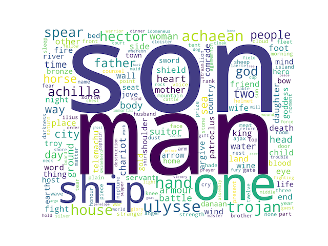
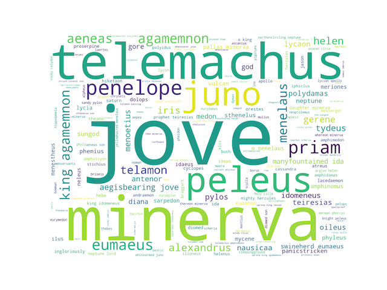
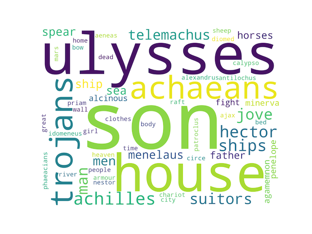
.. image:: ./figures/cloud-15.png

With Wordle
-----------

Wordle is a very nice word cloud program. After importing an entire carrel into Wordle and generating a word cloud, the student, researcher, or scholar can quickly and easily begin to tell a little story about any study carrel. For example, given the following visualisations, what story might you be to tell about the Iliad and the Odyssey?

.. image:: ./figures/cloud-01.png
   :width: 30%

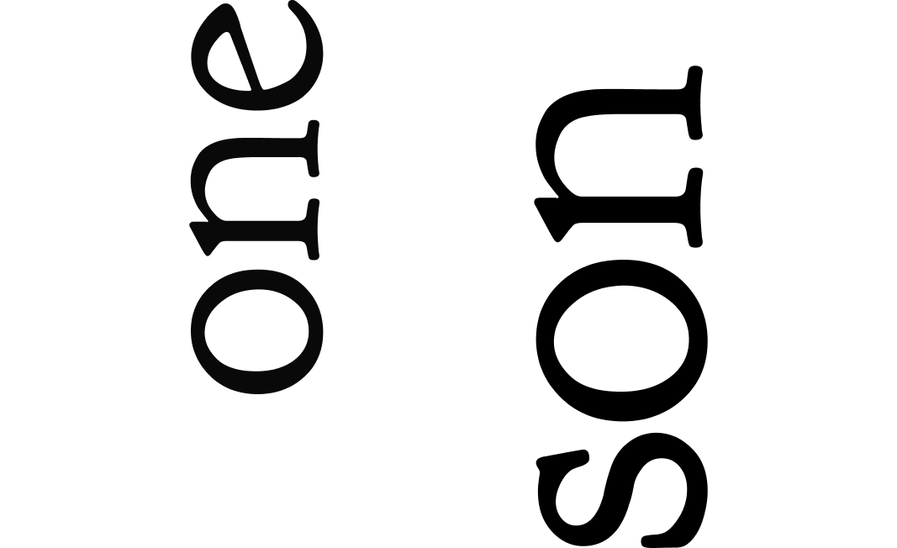

.. image:: ./figures/cloud-03.png
   :width: 30%

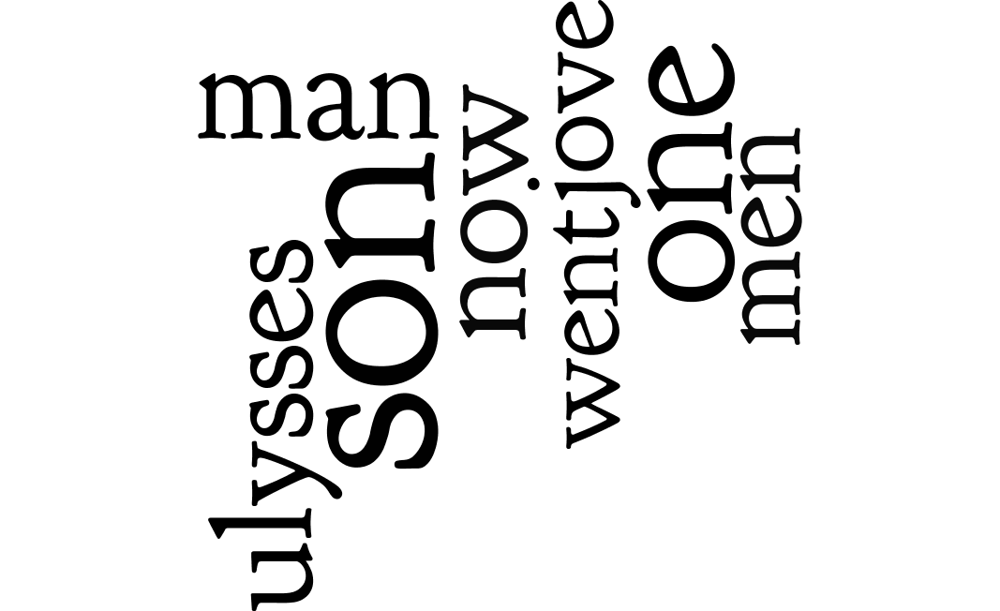

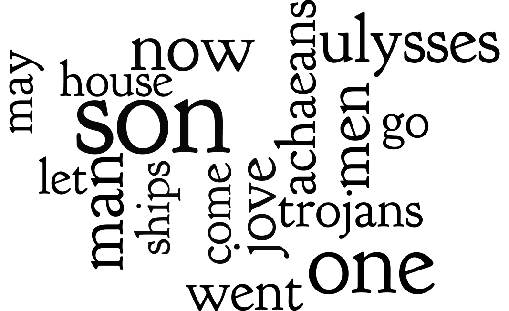

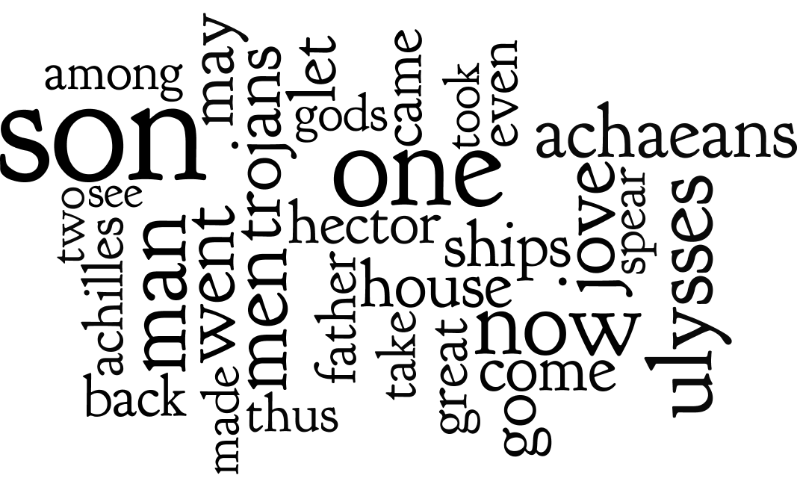

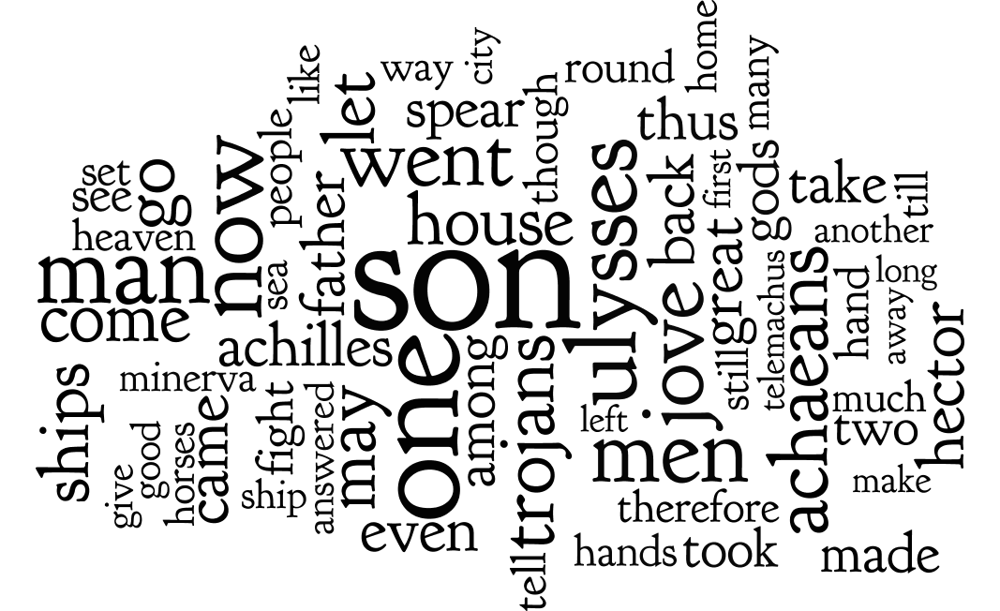

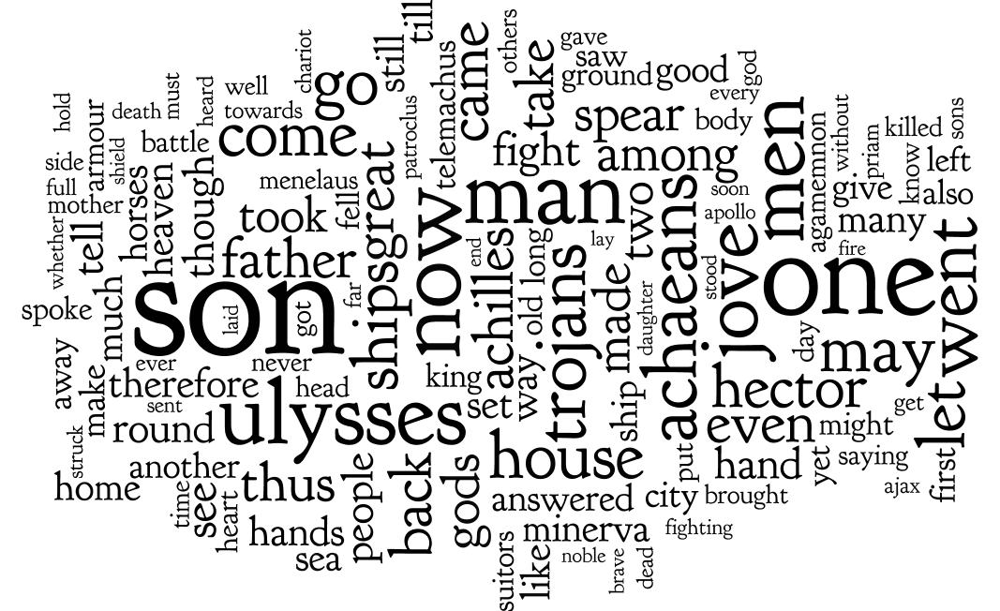

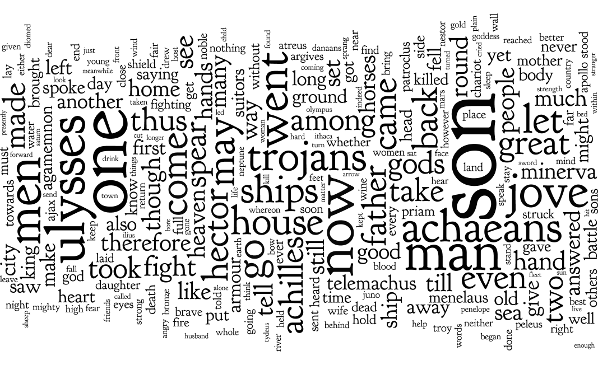

Here's a quick and dirty way to use World with content from any carrel:

1. use your text editor to open the file <carrel>/etc/reader.txt, where <carrel> is the name of your study carrel; for these purposes, open homer/etc/reader.txt in your text editor

2. look more closely at the result; as described in the section on the structure of a study carrel, reader.txt is a concatonation of all the plain text items in the carrel

3. select all the text in your text editor, and copy it to your clipboard

4. open Wordle, select the "Your Text" tab, and paste the contents of your clipboard into Wordle (see below); Wordle has no other way to get input

5. use the Layout/Maximum words... menu option to set the number of words to 1

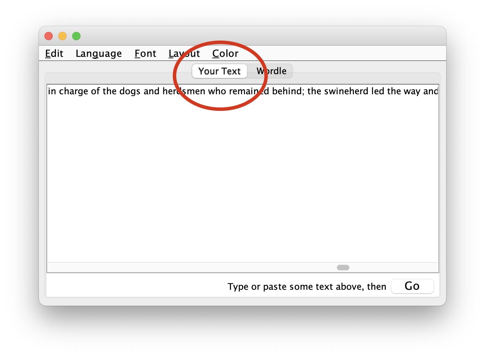

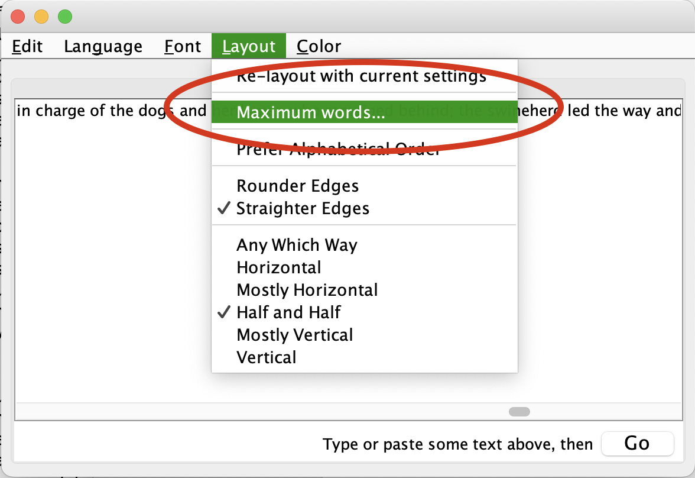

6. click the "Go" button

7. notice the results; answer the question, what is the most frequently used word (sans some stop words) in the corpus?

8. go to Step \#5, and double the value of maximum words

9. go to Step \#8 until you get tired

